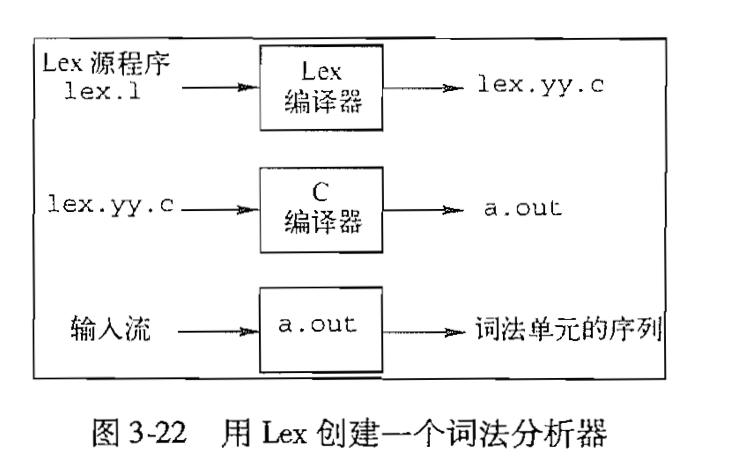
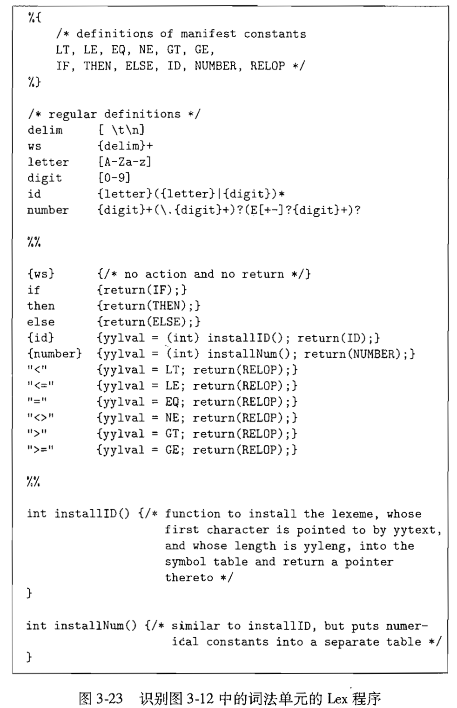
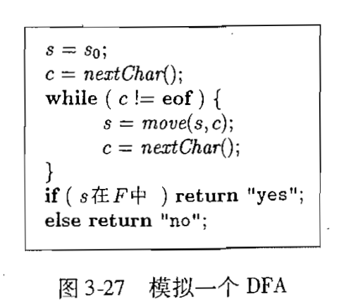

## 词法分析

> ε：epsilon，音标/ep'silon/，中文读音为“艾普西隆”

### 3.5 词法分析器生成工具Lex

> 它的核心部分， Lex 编译器将输入的模式转换成一个状态转换图， 并生成相应的实现代码， 并存放到文件 lex. yy. c 中。 这些代码模拟了状态转换图

#### 3.5.1 Lex的使用



1. 用 Lex 语言写出一个输入文件， 描述将要生成的词法 分析器。 在图中这个输入文件称为 lex.l
2. Lex 编译器将 lex. 1 转换成 C 语言程序， 存 放该程序的文件名总是 lex.yy. c
3. 最后，文件 lex. yy. c 总是被 C 编译器编译为一个名为 a. out 的文件。
4. 词法单元的属性值，不管它是 一个数字编码， 还是一个指向符号表的指针， 或者什么都没有， 都保存在全局变量 yylval 中 e 。 这个变量由词法分析器和语法分析器共享

#### 3.5.2 Lex程序的结构

```
声明部分
%%
转换规则
%%
辅助函数
```

+ 声明部分包括变量和明示常量(manifest constant, 被声明的表示一个常数的标识符，如一个词法单元的名字)的声明和正则定义

+ Lex程序的每个转换规则具有如下形式: `模式I动作I`
  - 每个模式是一个正则表达式，它可以使用声明部分中给出的正则定义
  - 动作部分是代码片段 (通常是用C语言编写的)
  
+ 程序的第三个部分包含各个动作需要使用的所有辅助函数
  
- 还有一种方法是将这些函数 单独编译，并与词法分析器的代码一起装载。
  
+ 词法分析器和语法分析器如何协同?
  - 当词法分析器被语法分析 器调用时，词法分析器开始从余下的输入中逐个读取字符，直到它发现了最长的与某个模式PI匹配的前缀
  - 然后， 词法分析器执行相关的动作A<sub>[i]</sub>。 通常A<sub>[i]</sub>会将控制返回给语法分析器
  - 然而， 如果它不返回控制（比如Pi描述的是空白符或注释），那么词法分析器就继续寻找其他的词素,直到某个动作将控制返回给语法分析器为止
  - 词法分析器只向语法分析器返回一个值， 即词法 单元名。
  - 但在需要时可以利用共享的整型变量yylval传递有关这个词素的附加信息

+ Lex词法分析程序示例

  
  
  + 声明部分
  
    1. 一对特殊的括号`%{ %}`
       - 出现在括号内的所有内容都被直接复制到 文件lex.yy. c中。 它们不会被当作正则定义处理
       - 我们一般将明示常量的定义放置在该括号内， 并利用C语言的#define语句给每个明示常量赋予一个唯一的整数编码
    2. 一个正则定义的序列
  
  + 转换规则
  
    1. `{ws} {/ *no action and not return*/ }`
  
       - 我们发现了一个空白字符，并不直接把它返回给语法分析器，而是继续寻找另一个词素
  
    2. `if {return (IF);}`
  
       - 如果我们在输入中 看到两个字母if,并且if之后没有跟随其他字母或数位（如果有的话， 词法分析器会去寻找一 个和id模式匹配的最长输入前缀），然后词法分析器从输入中读入这两个字符，并返回词法单元名IF,也就是明示常量IF所代表的整数值。
  
    3. `{id} {yylval = (int)installID(); return(ID)}; `
  
       - if关键字虽然也和id模式匹配，但是Lex总是选择最先被列出来的
  
       - 当id模式被匹配时
  
         1. 调用函数installID() 将找到的词素放入符号表中
  
         2. 该函数返回一个指向符号表的指针。 这个指针被放到全局变量yylval中， 并可被语法 分析器或编译器的某个后续组件使用
  
            - 函数install1D（）可以使用以下两个由Lex生成 的、由词法分析器自动赋值的变量：
  
              1. yytext是一个指向词素开头的指针
  
              2. yyleng存放刚找到的词素的长度
  
         3. 将词法单元名ID返回到语法分析器
  
       4. 当一个词素与模式number匹配时， 执行的处理与此类似， 它使用辅助函数 installNum() 完成处理。
  
  + 辅助函数
  
    1. 可以看到installID() 和installNum()两个函数
    2. 出现在辅助函数中的所有内容都直接复制到lex.yy.c中
    3. 虽然它们位于转换规则之后，但它们可以在转换规则的定义中使用

#### 3.5.3 Lex的冲突解决

+ 当输入的多个前缀与一个或多个模式 匹配时，Lex用如下规则选择正确的词素：
  1. 总是选择最长的前缀
  2. 如果最长的可能前缀与多个模式匹配，总是选择在Lex程序中先被列出的模式

####  3.5.4 向前看运算符

+ Lex自动地向前读入一个字符，它会读取到形成被选词素的全部字符之后的那个字符，然后
  再回退输入，使得只有词素本身从输入中消耗掉
+ 在某些时候，我们希望仅当词素的后面跟随特定的其他字符时，这个词素才能和某个特定的模式相匹配
  - 在这种情况下，我们可以在模式中用斜线来指明该模式中和词素实际匹配的部分的结尾，斜线/之后的内容表示一个附加的模
    式
  - 但是和第二个模式(附加模式)匹配的字符并不是这个词素的一部分。

### 3.6 有穷自动机

+ Lex通过`有穷自动机(finite automata)`的表示方法将输出程序转换成词法分析器
+ 这些自动机在本质上是与状态转换图类似的图， 但有如下几点不同
  1. 有穷自动机是识别器（recognizer），它们只能对每个可能的输入串简单地回答“是”或“否”。
  2. 有穷自动机分为两类
     + ①不确定的有穷自动机（ Nondeterministic Finite Automata, NFA） 对其边上的标号没有任何限制。一个符号标记离开同一状态的多条边，并且空串e也可以作为标号。
     + ②对于每个状态及自动机输入字母表中的每个符号，确定的有穷自动机（Deterministic Finite Automata, DFA）有且只有一条离开该状态、以该符号为标号的边
+ 确定的和不确定的有穷自动机能识别的语言的集合是相同的，都是正则语言

#### 3.6.1 不确定的有穷自动机

+ 一个不确定的有穷自动机（NFA）由以下几个部分组成
  1. 一个有穷的状态集合S
  2. 一个输入符号集合∑ ，即榆入字母表 (input alphabet) 。 我们假设代表空串的 ε不是∑ 中的元素。
  3. 一个转换函数 (transition function) ， 它为每个状态和 ∑U {ε}中的每个符号都给出了相应的后继状态(next state)的集合
  4. S中的一个状态S<sub>0</sub>被指定为开始状态，或者说初始状态
  5. S的子集F被指定为接受状态(或者说终止状态)的集合
+ 不管是 NFA 还是 DFA, 我们都可以将它表示为一张转换图 (transition graph) 。 
  1. 图中的结点是状态， 带有标号的边表示自动机的转换函数。
  2.  从状态 s 到状态 t 存在一条标号为a 的边当且仅当 状态t是状态s在输入a上的后继状态之一。
  3. 这个图与状态转换图十分相似，但是:
     - ①同 一个符号可以标记从同一状态出发到达多个目标状态的多条边。
     - ②一 条边的标号不仅可以是输入字母表中的符号，也可以是空符号串ε。

+ 一个能够识别正则表达式 (a|b)<sup>*</sup>abb的语言的NFA转换图

  

  - 这是一个不确定的有穷自动机
  - 描述了所有由a,b组成且以abb结尾的字符串
  - 状态 3 的双圈 a 表明该状态是接受状态
  - 从状态 0 到 达接受状态的所有路径都是先在状态 0 上运行 一段时间，然后从输入中读取abb, 从，分别进入状 b 态 1 、 2 和 3 。
  - 因此能够到达接受状态的所有字符串都是以abb结尾的

#### 3.6.2 转换表


+ 我们也可以将一个NFA表示为一张转换表 (transition table), 表的各行对应于状态， 各列对应于输入符号和 ε 。 
+ 对应于一个给定状态和给定 输入的条目是将 NFA 的转换函数应用于这些参数后得到的值。 
+ 如果转换函数没有给出对应于某 个状态-输入对的信息，我们就把0放入相应的表项中
+ 优缺点:
  + 优点是我们能够很容易地确定和一个给定状态和一个输入符号相对应的转换。 
  + 缺点是如果输入字母表很大，且大多数状态在大多数输入字符上没有转换的时候，转换表需 要占用大量空间。

#### 3.6. 3 自动机输入字符串的接受

+ 一个 NFA 接受 (accept) 输入字符串x， 当且仅当对应的转换 图中存在一条从开始状态到某个接受状态的路径， 使得该路径中各条边上的标号组成符号串x。

+ 注意， 路径中的 ε 标号将被忽略, 因为空串不会影响到根据路径构建得到的符号串。

+ 例如对于NFA的接受符号串aabb

  + 存在从状态0到达状态3的路径， 状态3是接受状态，符合要求

    

  + 存在从状态0到达状态0的路径，状态0不是接受状态，不符合要求

    

+ 只要存在某条其标号序列为某符号串的路径能够从开始状态到达某个接受状态，NFA就接受这个符号串

+ 由一个NFA定义（或接受）的语言是从开始状态到某个接受状态的所有路径上的**标号串的集合**

+ 可以用L(A)表示自动机A接受的语言

+ 例如下图是一个接受`L(aa*|bb*)`的NFA

  

  
  
  + 因为存在路径` 0 -> 1 -> 2 -> 2 -> 2`, 字符串aaa被这个NFA接受。
  +  路径的中的 ε标号在连接时"消失"了，因此这条路径的标号是aaa

####  3.6.4 确定的有穷自动机

+ 确定的有穷自动机(DFA)，是不确定的有穷自动机的特例:

  1. 没有输出之上的转换动作
  2. 对每个状态s和每个输入符号a,有且只有一条标号为a的边离开

+ NFA 抽象地表示了用来识别某个语言中的串的算法

+  而相应的 DFA 则是一个简单具体的识别串的算法

+ 在构造词法分析器时，我们真正实现或模拟的是DFA

+ 模拟一个DFA

  

  - 输入：一个以文件结束符eof结尾的字符串 x 。 DFA  D 的开始状态为s<sub>0</sub>，接受状态集为F，转换函数为move
  - 输出：如果D 接受x, 则回答“yes"，否则回答“no”
  - 方法：把上图中的算法应用于输入字符串x。 函数move给出了从状态s出发，标号为c的边所到达的状态。函数 nextchar返回输入串x的下一个字符。

### 3.7 从正则表达式到自动机

+ 由于NFA的不确定性，因此实际中，我们需要将NFA转换为一个识别相同语言的DFA

#### 3.7.1 从NFA到DFA的转换

+ 子集构造法的思想是让构造得到的DFA每个状态对应于NFA的状态集合

  - DFA 在读入输入a<sub>0</sub>a<sub>1</sub>...a<sub>n</sub>册之后到达的状态对应于相应NFA从开始状态出发， 沿着以a<sub>0</sub>a<sub>1</sub>...a<sub>n</sub>为标 号的路径能够到达的状态的集合

+ DFA的状态数有可能是NFA状态数的指数 (实践中没有出现过)

  -  在这种情况下， 我们在试图实现这个DFA时 会遇到困难。 
  - 然而， 基于自动机的词法分析方法的处理能力部分源于如下事实：对于一个真 实的语言，它的NFA和DFA的状态数量大致相同，状态数量呈指数关系的情形尚未在实践中

+ NFA构造DFA的子集构造(subset construction)算法

  - 输入: 一个NFA _N_
  - 输出: 一个接受同样语言的DFA _D_
  - 方法: 
    1. 为_D_构造一个转换表_Dtran_
    2. _D_的每个状态是一个NFA状态集合， 我们将构造_Dtran_,使得_D_ "并行地"模拟_N_在遇到一个给定输出串时，可能执行的动作

  - 下图是NFA状态集上的操作

    

    - 上图定义了如何正确处理_N_的ε转换
    - s代表_N_的单个状态
    - _T_代表_N_的一个状态集

  - 我们必须找出当N读入了某个输出串之后可能位于的所有状态集合

    1. 首先, 读入第一个输入符号之前, _N_可以位于集合ε-closure(s<sub>0</sub>)中的任何状态上，s<sub>0</sub>是_N_的开始状态
    2. 假定_N_在读入输出串x之后可以位于集合_T_中的状态上
       + 假如下一个输出符号是a, 那么_N_可以立即移动到集合move(_T_, a)中的任何状态
       + 然而，_N_可以经过几个ε转换，因此_N_读入ax之后，可位于ε-closure(move(_T_,a))中的任何状态

  - 根据上面的思想， 我们可以得到下图显示的方法，该方法构造了_D_的状态集合_Dstates_和_D_的转换函数_Dtran_

    

    - _D_的开始状态是ε-closure(s<sub>0</sub>), _D_的接受状态是所有**至少包含了N的一个接受状态**的状态集合

    - 我们只需要说明如何对NFA的任何状态集合T计算 ε-closure(_T_),就可以完整地描述子集构造法

      - 下图描述了如何计算 ε-closure(_T_)

      

+ 示例，对于(a|b)*abb的NFA， 如何转换为DFA？

  

+ 等价NFA的开始状态_A_是ε-closure(0), 即为A = {0, 1, 2, 4, 7}, _A_中的状态就是能从状态0出发，只经过标号ε为的路径到达的所有状态

### 3.7.2 NFA的模拟

