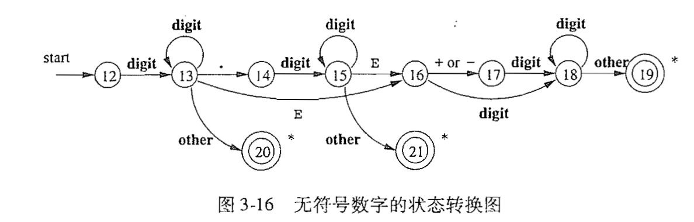
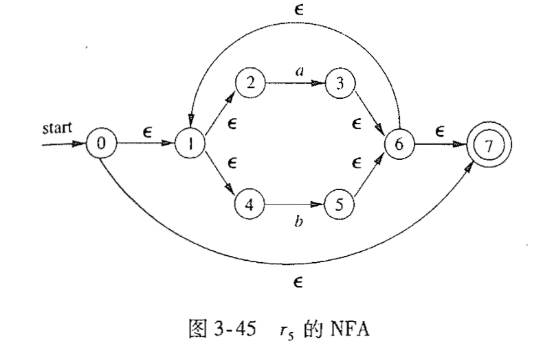

## 词法分析

> ε：epsilon，音标/ep'silon/，中文读音为“艾普西隆”
>
> ∑ 是一个求和符号，英语名称：sigma，汉语名称：[西格玛]

- 自动生成一个词法分析器: 向一个词法分析生成工具(lexical-analyzer generator)描述词素的模式， 然后将这些模式编译为居右词法分析器功能的代码
  - 这种方法使修改词法分析器的工作变得更加简单， 因为我们只需改写那些受到影响的模式，无需改写整个软件
  - 这种方法还加快额词法分析器的实现速度，因为程序员只需要在很高的模式层次上描述软件，就可以依赖生成工具来生成详细的代码
- 正则表达式是一种可以很方便的描述词素模式的方法
- 如何对正则表达式进行转换
  1. 首先转换为不确定有穷自动 机(NFA)，然后再转换为确定有穷自动机(DFA)
  2. 后两种表示方法(NFA, DFA)可以作为一个“驱动程序”的输入
  3. 这个驱动程序就是一段模拟这些自动机的代码， 它使用这些自动机来确定下一个词法单元。

### 3.1 词法分析器的作用

+ 词法分析是编译的第一阶段

+ 词法分析器的主要任务是读入源程序的输入字符、将它们组 成词素，生成并输出一个词法单元序列，每个词法单元对应于一个词素

+ 这个词法单元序列被输出到语法分析器进行语法分析

+  词法分析器通常还要和符号表进行交互

  - 当词法分析器发现了 一个标识符的词素时，它要将这个词素添加到符号表中
  - 在某些情况下，词法分析器会从符号表 中读取有关标识符种类的信息，以确定向语法分析器传送哪个词法单元

+ 图3-1给出了交互过程

  

  - 通常， 交互是由语法分析器调用词法分析器来实现的
  - 图中的命令getNextToken所指示的调用使得词法分析器从它的输入中不断读取字符，直到它识别出下 一个词素为止。
  - 词法分析器根据这个词素生成下一个词法单元并返回给语法分析器

+ 词法分析器还会完成一些识别词素之外的其他任务

  1. 过滤掉源程序中的注释和空白（空格、换行符、制表符以及在输入中用于分隔词法单元的其他字符）
  2. 将编译器生成的错误消息与源程序的位置联系起来。例如，词法分析器可以负责记录遇到的换行符的个数， 以便给每个出错消息赋予一个行号
  3. 如果源程序使用了一 个宏预处理器，则宏的扩展也可以由词法分析器完成。

+ 有时，词法分析器可以分成两个级联的处理阶段：

  1. 扫描阶段主要负责完成一些不需要生成词法单元的简单处理， 比如删除注释和将多个连 续的空白字符压缩成一个字符。
  2. 词法分析阶段是较为复杂的部分,它处理扫描阶段的输出并生成词法单元。

#### 3.1.1 词法分析及语法分析

+ 把编译过程的分析部分划分为词法分析和语法分析阶段有如下几个原因
  1. 最重要的考虑是简化编译器的设计
  2. 提高编译器的效率
  3. 增强编译器的可移植性

#### 3.1.2 词法单元、模式和词素

+ 词法单元: 由一个词法单元名和一个可选的属性值组成
  - 词法单元名是一个表示某种词法 单位的抽象符号， 比如一个特定的关键字， 或者代表一个标识符的输入字符序列
  - 词法 单元名字是由语法分析器处理的输入符号
+ 模式: 描述了一个词法单元的词素可能具有的形式
  - 当词法单元是一个关键字时， 它的模 式就是组成这个关键字的字符序列。
  - 对于标识符和其他词法单元， 模式是一个更加复杂 的结构，它可以和很多符号串匹配
+ 词素: 是源程序中的一个字符序列
  -  它和某个词法单元的模式匹配， 并被词法分析器识别 为该词法单元的一个实例。

- 例3.1， 图3-2给了一些词法单元的例子

  

- 下面的类别覆盖了大部分或所有的词法单元

  1. 每个关键字有一个词法单元。一个关键字的模式就是该关键字本身
  2. 表示运算符的词法单元。它可以表示单个运算符，也可以像图3-2中的comparison那样，表示 一类运算符。
  3. 一个表示所有标识库的词法单元
  4. 一个或多个表示常量的词法单元，比如数字和字面值字符串。
  5. 每一个标点符号有一个词法单元，比如左右括号、逗号和分号。

#### 3.1.3 词法单元的属性

- 一个标识符的属性值是一 个指向符号表中该标识符对应条目的指针。

- 例3.2， 对于Fortran语句 E= M * C ** 2  中的词法单元名字和相关属性如下

  ```
  <id,指向符号表中E的条目的指针>
  <assign_op>
  <id,指向符号表中M的条目的指针>
  <mult^op>
  <id,指向符号表中C的条目的指针>
  <exp_op>
  <number,整数值 2>
  ```

  - 词法单元 number 有一个整数属性值。 
  - 在实践中， 编译器将保存一个代表该常量的字符串， 并将 一个指向该字符串的指针作为number的属性值。

#### 3.1.4 词法错误

+ 如果没有其他组件的帮助， 词法分析器很难发现源代码中的错误
+ 假设出现所有词法单元的模式都无法和剩余输入的某个前缀相匹配的情况，此时词法 分析器就不能继续处理输入。当出现这种情况时，最简单的错误恢复策略是“恐慌模式”恢复。 我们从剩余的输入中不断删除字符， 直到词法分析器能够在剩余输入的开头发现一个正确的词 法单元为止
+ 可能采取的其他错误恢复动作包括
  1. 从剩余的输入中删除一个字符。
  2. 向剩余的输入中插入一个遗漏的字符。
  3. 用一个字符来替换另一个字符。
  4. 交换两个相邻的字符

### 3.2 输入缓冲

+ 先讨论集中可以加快源程序读入速度的方法
  1. 我们将介绍一种双缓冲区方案， 这 种方案能够安全地处理向前看多个符号的问题
  2. 然后我们将考虑一种改进方法。 这种方法使用 “哨兵标记”来节约用于检查缓冲区末端的时间。

#### 3.2.1 缓冲区对

+ 利用缓冲技术来减少用于处理单个输入字符的时间开销

+ 一种重要的机制就是利用 两个交替读人的缓冲区，如图3-3所示。

  

  - 每个缓冲区的容量都是 N 个字符， 通常 N 是一个磁盘块的大小， 如 4096 字节。
  - 我们可以使 用系统读取命令一次将 N 个字符读人到缓冲区中， 而不是每读入一个字符调用一次系统读取命 令
  - 如果输入文件中的剩余字符不足 N 个， 那么就会有一个特殊字符（用 eof 表示）来标记源文 件的结束

+ 程序为输入维护了两个指针:

  1. lexemeBegin 指针：该指针指向当前词素的开始处。 当前我们,正试图确定这个词 素的结尾。
  2. forward 指针：它一直向前扫描， 直到发现某个模式被匹配为止。 做出这个决定所依据 的策略将在本章的其余部分中讨论。

+ 一旦确定了下一个词素， forward 指针将指向该词素结尾的字符

+  词法分析器将这个词素 作为某个返回给语法分析器的词法单元的属性值记录下来。

+ 然后使 lexemeBegin 指针指向刚刚找到的词素之后的第一个字符

+ 将 forward 指针前移要求我们首先检查是否已经到达某个缓冲区的末尾。 

+ 如果是， 我们必 须将 N 个新字符读到另一个缓冲区中， 且将 forwnrd 指针指向这个新载入字符的缓冲区的头 部。

#### 3.2.2 哨兵标记

+ 在上个方案中， 每读入一个字符，我 们需要做两次测试

  1. 检查是否到达缓冲区的末尾
  2. 确定读入的字符是什么（后者 可能是一个多路分支选择语句）

+ 如果我们扩展每个缓冲区， 使它们在末尾包含一个“哨兵” （ sentinel） 字符， 我们就可以把对缓冲区末端的测试和对当前字符的测试合二为一

+ 这个哨兵字 符必须是一个不会在源程序中出现的特殊字符，一个自然的选择就是字符eof。

+ 图3-4是添加了哨兵标记的缓冲区, 图3-5 总结了forward指针的算法

  

  

### 3.3 词法单元的规约

+ 正则表达式是一种用来描述词素模式的重要表示方法

#### 3.3.1 串和语言

+ 字母表（alphabet）是一个有限的符号集合。 符号的典型例子包括字母、数位和标点符号
+ 某个字母表上的一个串 （string） 是该字母表中符号的一个有穷序列
+ 串s的长度，通常记|s|，是指s中符号出现的次数
+ 空串（empty string）是长度为0的串, 用ε表示
+ 语言（language）是某个给定字母表上一个任意的可数的串集合

#### 3.3.2 语言的运算

+ 词法分析中，最重要的语言上的运算是并，连接和闭包运算

  


+ 一个语言L的Kleene闭包，记为L*, 即将L连接0次货多次后得到的串集
+ L<sup>0</sup>即为将L连接0次得到的集合，记为{ε}
+ L的正闭包L<sup>+</sup> + L<sup>0</sup>= L*

#### 3.3.3正则表达式

+ 正则表达式归纳的基础:

  1. ε是一个正则表达式，L(ε)= {ε},即该语言只包含空串。
  2. 如果a 是∑上的一个符号， 那么**a**是一个正则表达式， 并且L(**a**) = {a}

+ 归纳步骤：由小的正则表达式构造较大的正则表达式的步骤有四个部分。 假定r和s都是正 则表达式，分别表示语言必L(r)和L(s),那么

  1. (r)|(s) 是一个正则表达式，表示语言L(r) U L(s)。
  2. (r)(s) 是一个正则表达式，表示语言L(r)L(s)。
  3. (r)* 是一个正则表达式，表示语言(L(r))*
  4. (r) 是一个正则表达式, 表示语言L(r)

+ 我们采用如下的约定，就 可以丢掉一些括号：

  1. 一元运算符*具有最高的优先级，并且是左结合的
  2. 连接具有次高的优先级，它也是左结合的
  3. |的优先级最低，并且也是左结合的

+ 例3.4， 令 ∑ = {a, b}

  1. 正则表达式a|b表示语言{ a, b}
  2. 正则表达式(a|b) (a|b)表示语言{aa, ab, ba, bb} ,即在字母表2上长度为2的所有串的集合。也可以用aa|ab|ba|bb表示
  3. 正则表达式a*表示所有由零个或多个a组成的串的集合，即{ε, a, aa, aaa,...}

  

#### 3.3.4 正则定义

+ 例3.5， c语言的标识符是由字母，数字和下划线组成的串

  

+ 例3.6，形如5280， 0.01234，6.336E4或1.89E-4的串

  

#### 3.3.5 正则表达式的扩展

+ 例3-5正则定义，改下为下图:

  

+ 例3-6中的正则定义，改下为下图:

  

+ 扩展表示法, 如图3-8:

  

### 3.4词法单元的识别

+ 分支语句的文法，以及一些词法单元的模式

  

  

  

#### 3.4.1 状态转换图

+ 状态转换图: 作为构造词法分析器的一个中间步骤， 我们首先将模式转换成具有特定风格的流图
+ 状态转换图（transition diagram）有--组被称为"状态"（state）的结点或圆圈
+ 状态图中的边 （edge） 从图的一个状态指向另一个状态。 每条边的标号包含了一个或多个符号
  - 如果我们处于某个状态 s , 并且下一个输入符号是 a , 我们就会寻找一条从 s 离开 且标号为a的边
  - 如果我们找到了这样的一条边， 就将forward指针前移， 并进入状态转换图中该边所指的状态

+ 一些关于状态转换图 的重要约定如下

  1. 某些状态称为接受状态或最终状态。
     - 这些状态表明已经找到了一个词素, ， 虽然实际的词素可能并不包括lexemeBegin指针和forward指针之间的所有字符
     - 我们用双层的圈来表示一个接受状态
     - 并且如果该状态要执行一个动作的话——通常是向语法分析器返回一个词法单元和相 关属性值——我们将把这个动作附加到该接受状态上
  2.  如果需要将forward指针 回退一个位置(即相应的词素并不包含那个在最后一步使 我们到达接受状态的符号), 那么我们**将在该接受状态的附近加上一个***
  3. 有一个状态被指定为开始状态， 也称初始状态， 该状态由一条没有出发结点的、标号为 “start”的边指明。 
     - 在读入任何输入符号之前，状态转换图总是位于它的开始状态

+ 例3.9， 图3-13给出了能够识别所有与词法单元relop匹配的词素的状态转换图

  

  - 请注意，状态4，状态8都有一个*号，说明我们必须回退一个位置

#### 3.4.2 保留字和标识符的识别

- 如果使用下面的转换图，怎么区分id标识符和关键字?

  

+ 使用下面两种方法来处理那些关键字

  1. 初始化时就将各个保留字填入符号表中

  2. 为每个关键字建立单独的状态转换图

     - 优先识别关键字的词法单元

       

       


+ 图3-16显示了词法单元number的状态转换图

  

+ 空白符的状态转换图

  - delim表示空白字符, 空格，制表符，换行符等

  

#### 3.4.4 基于状态转换图的词法分析器的体系结构

+ 根据图3-13实现的relop代码实现

  

### 3.5 词法分析器生成工具Lex

> 它的核心部分， Lex 编译器将输入的模式转换成一个状态转换图， 并生成相应的实现代码， 并存放到文件 lex. yy. c 中。 这些代码模拟了状态转换图

#### 3.5.1 Lex的使用


1. 用 Lex 语言写出一个输入文件， 描述将要生成的词法 分析器。 在图中这个输入文件称为 lex.l
2. Lex 编译器将 lex. 1 转换成 C 语言程序， 存 放该程序的文件名总是 lex.yy. c
3. 最后，文件 lex. yy. c 总是被 C 编译器编译为一个名为 a. out 的文件。
4. 词法单元的属性值，不管它是 一个数字编码， 还是一个指向符号表的指针， 或者什么都没有， 都保存在全局变量 yylval 中 e 。 这个变量由词法分析器和语法分析器共享

#### 3.5.2 Lex程序的结构

```
声明部分
%%
转换规则
%%
辅助函数
```

+ 声明部分包括变量和明示常量(manifest constant, 被声明的表示一个常数的标识符，如一个词法单元的名字)的声明和正则定义

+ Lex程序的每个转换规则具有如下形式: `模式I动作I`
  - 每个模式是一个正则表达式，它可以使用声明部分中给出的正则定义
  - 动作部分是代码片段 (通常是用C语言编写的)
  
+ 程序的第三个部分包含各个动作需要使用的所有辅助函数
  
- 还有一种方法是将这些函数 单独编译，并与词法分析器的代码一起装载。
  
+ 词法分析器和语法分析器如何协同?
  - 当词法分析器被语法分析 器调用时，词法分析器开始从余下的输入中逐个读取字符，直到它发现了最长的与某个模式PI匹配的前缀
  - 然后， 词法分析器执行相关的动作A<sub>[i]</sub>。 通常A<sub>[i]</sub>会将控制返回给语法分析器
  - 然而， 如果它不返回控制（比如Pi描述的是空白符或注释），那么词法分析器就继续寻找其他的词素,直到某个动作将控制返回给语法分析器为止
  - 词法分析器只向语法分析器返回一个值， 即词法 单元名。
  - 但在需要时可以利用共享的整型变量yylval传递有关这个词素的附加信息

+ Lex词法分析程序示例

  
  
  + 声明部分
  
    1. 一对特殊的括号`%{ %}`
       - 出现在括号内的所有内容都被直接复制到 文件lex.yy. c中。 它们不会被当作正则定义处理
       - 我们一般将明示常量的定义放置在该括号内， 并利用C语言的#define语句给每个明示常量赋予一个唯一的整数编码
    2. 一个正则定义的序列
  
  + 转换规则
  
    1. `{ws} {/ *no action and not return*/ }`
  
       - 我们发现了一个空白字符，并不直接把它返回给语法分析器，而是继续寻找另一个词素
  
    2. `if {return (IF);}`
  
       - 如果我们在输入中 看到两个字母if,并且if之后没有跟随其他字母或数位（如果有的话， 词法分析器会去寻找一 个和id模式匹配的最长输入前缀），然后词法分析器从输入中读入这两个字符，并返回词法单元名IF,也就是明示常量IF所代表的整数值。
  
    3. `{id} {yylval = (int)installID(); return(ID)}; `
  
       - if关键字虽然也和id模式匹配，但是Lex总是选择最先被列出来的
  
       - 当id模式被匹配时
  
         1. 调用函数installID() 将找到的词素放入符号表中
  
         2. 该函数返回一个指向符号表的指针。 这个指针被放到全局变量yylval中， 并可被语法 分析器或编译器的某个后续组件使用
  
            - 函数install1D（）可以使用以下两个由Lex生成 的、由词法分析器自动赋值的变量：
  
              1. yytext是一个指向词素开头的指针
  
              2. yyleng存放刚找到的词素的长度
  
         3. 将词法单元名ID返回到语法分析器
  
       4. 当一个词素与模式number匹配时， 执行的处理与此类似， 它使用辅助函数 installNum() 完成处理。
  
  + 辅助函数
  
    1. 可以看到installID() 和installNum()两个函数
    2. 出现在辅助函数中的所有内容都直接复制到lex.yy.c中
    3. 虽然它们位于转换规则之后，但它们可以在转换规则的定义中使用

#### 3.5.3 Lex的冲突解决

+ 当输入的多个前缀与一个或多个模式 匹配时，Lex用如下规则选择正确的词素：
  1. 总是选择最长的前缀
  2. 如果最长的可能前缀与多个模式匹配，总是选择在Lex程序中先被列出的模式

####  3.5.4 向前看运算符

+ Lex自动地向前读入一个字符，它会读取到形成被选词素的全部字符之后的那个字符，然后
  再回退输入，使得只有词素本身从输入中消耗掉
+ 在某些时候，我们希望仅当词素的后面跟随特定的其他字符时，这个词素才能和某个特定的模式相匹配
  - 在这种情况下，我们可以在模式中用斜线来指明该模式中和词素实际匹配的部分的结尾，斜线/之后的内容表示一个附加的模
    式
  - 但是和第二个模式(附加模式)匹配的字符并不是这个词素的一部分。

### 3.6 有穷自动机

+ Lex通过`有穷自动机(finite automata)`的表示方法将输出程序转换成词法分析器
+ 这些自动机在本质上是与状态转换图类似的图， 但有如下几点不同
  1. 有穷自动机是识别器（recognizer），它们只能对每个可能的输入串简单地回答“是”或“否”。
  2. 有穷自动机分为两类
     + ①不确定的有穷自动机（ Nondeterministic Finite Automata, NFA） 对其边上的标号没有任何限制。一个符号标记离开同一状态的多条边，并且空串e也可以作为标号。
     + ②对于每个状态及自动机输入字母表中的每个符号，确定的有穷自动机（Deterministic Finite Automata, DFA）有且只有一条离开该状态、以该符号为标号的边
+ 确定的和不确定的有穷自动机能识别的语言的集合是相同的，都是正则语言

#### 3.6.1 不确定的有穷自动机

+ 一个不确定的有穷自动机（NFA）由以下几个部分组成
  1. 一个有穷的状态集合S
  2. 一个输入符号集合∑ ，即榆入字母表 (input alphabet) 。 我们假设代表空串的 ε不是∑ 中的元素。
  3. 一个转换函数 (transition function) ， 它为每个状态和 ∑U {ε}中的每个符号都给出了相应的后继状态(next state)的集合
  4. S中的一个状态S<sub>0</sub>被指定为开始状态，或者说初始状态
  5. S的子集F被指定为接受状态(或者说终止状态)的集合
+ 不管是 NFA 还是 DFA, 我们都可以将它表示为一张转换图 (transition graph) 。 
  1. 图中的结点是状态， 带有标号的边表示自动机的转换函数。
  2.  从状态 s 到状态 t 存在一条标号为a 的边当且仅当 状态t是状态s在输入a上的后继状态之一。
  3. 这个图与状态转换图十分相似，但是:
     - ①同 一个符号可以标记从同一状态出发到达多个目标状态的多条边。
     - ②一 条边的标号不仅可以是输入字母表中的符号，也可以是空符号串ε。

+ 一个能够识别正则表达式 (a|b)<sup>*</sup>abb的语言的NFA转换图

  

  - 这是一个不确定的有穷自动机
  - 描述了所有由a,b组成且以abb结尾的字符串
  - 状态 3 的双圈 a 表明该状态是接受状态
  - 从状态 0 到 达接受状态的所有路径都是先在状态 0 上运行 一段时间，然后从输入中读取abb, 从，分别进入状 b 态 1 、 2 和 3 。
  - 因此能够到达接受状态的所有字符串都是以abb结尾的

#### 3.6.2 转换表


+ 我们也可以将一个NFA表示为一张转换表 (transition table), 表的各行对应于状态， 各列对应于输入符号和 ε 。 
+ 对应于一个给定状态和给定 输入的条目是将 NFA 的转换函数应用于这些参数后得到的值。 
+ 如果转换函数没有给出对应于某 个状态-输入对的信息，我们就把0放入相应的表项中
+ 优缺点:
  + 优点是我们能够很容易地确定和一个给定状态和一个输入符号相对应的转换。 
  + 缺点是如果输入字母表很大，且大多数状态在大多数输入字符上没有转换的时候，转换表需 要占用大量空间。

#### 3.6. 3 自动机输入字符串的接受

+ 一个 NFA 接受 (accept) 输入字符串x， 当且仅当对应的转换 图中存在一条从开始状态到某个接受状态的路径， 使得该路径中各条边上的标号组成符号串x。

+ 注意， 路径中的 ε 标号将被忽略, 因为空串不会影响到根据路径构建得到的符号串。

+ 例如对于NFA的接受符号串aabb

  + 存在从状态0到达状态3的路径， 状态3是接受状态，符合要求

    

  + 存在从状态0到达状态0的路径，状态0不是接受状态，不符合要求

    

+ 只要存在某条其标号序列为某符号串的路径能够从开始状态到达某个接受状态，NFA就接受这个符号串

+ 由一个NFA定义（或接受）的语言是从开始状态到某个接受状态的所有路径上的**标号串的集合**

+ 可以用L(A)表示自动机A接受的语言

+ 例如下图是一个接受`L(aa*|bb*)`的NFA

  

  
  
  + 因为存在路径` 0 -> 1 -> 2 -> 2 -> 2`, 字符串aaa被这个NFA接受。
  +  路径的中的 ε标号在连接时"消失"了，因此这条路径的标号是aaa

####  3.6.4 确定的有穷自动机

+ 确定的有穷自动机(DFA)，是不确定的有穷自动机的特例:

  1. 没有输出之上的转换动作
  2. 对每个状态s和每个输入符号a,有且只有一条标号为a的边离开

+ NFA 抽象地表示了用来识别某个语言中的串的算法

+  而相应的 DFA 则是一个简单具体的识别串的算法

+ 在构造词法分析器时，我们真正实现或模拟的是DFA

+ 模拟一个DFA

  

  - 输入：一个以文件结束符eof结尾的字符串 x 。 DFA  D 的开始状态为s<sub>0</sub>，接受状态集为F，转换函数为move
  - 输出：如果D 接受x, 则回答“yes"，否则回答“no”
  - 方法：把上图中的算法应用于输入字符串x。 函数move给出了从状态s出发，标号为c的边所到达的状态。函数 nextchar返回输入串x的下一个字符。

### 3.7 从正则表达式到自动机

+ 由于NFA的不确定性，因此实际中，我们需要将NFA转换为一个识别相同语言的DFA

#### 3.7.1 从NFA到DFA的转换

+ 子集构造法的思想是让构造得到的DFA每个状态对应于NFA的状态集合

  - DFA 在读入输入a<sub>0</sub>a<sub>1</sub>...a<sub>n</sub>册之后到达的状态对应于相应NFA从开始状态出发， 沿着以a<sub>0</sub>a<sub>1</sub>...a<sub>n</sub>为标 号的路径能够到达的状态的集合

+ DFA的状态数有可能是NFA状态数的指数 (实践中没有出现过)

  -  在这种情况下， 我们在试图实现这个DFA时 会遇到困难。 
  - 然而， 基于自动机的词法分析方法的处理能力部分源于如下事实：对于一个真 实的语言，它的NFA和DFA的状态数量大致相同，状态数量呈指数关系的情形尚未在实践中

+ NFA构造DFA的子集构造(subset construction)算法

  - 输入: 一个NFA _N_
  - 输出: 一个接受同样语言的DFA _D_
  - 方法: 
    1. 为_D_构造一个转换表_Dtran_
    2. _D_的每个状态是一个NFA状态集合， 我们将构造_Dtran_,使得_D_ "并行地"模拟_N_在遇到一个给定输出串时，可能执行的动作

  - 下图是NFA状态集上的操作

    

    - 上图定义了如何正确处理_N_的ε转换
    - s代表_N_的单个状态
    - _T_代表_N_的一个状态集

  - 我们必须找出当N读入了某个输出串之后可能位于的所有状态集合

    1. 首先, 读入第一个输入符号之前, _N_可以位于集合ε-closure(s<sub>0</sub>)中的任何状态上，s<sub>0</sub>是_N_的开始状态
    2. 假定_N_在读入输出串x之后可以位于集合_T_中的状态上
       + 假如下一个输出符号是a, 那么_N_可以立即移动到集合move(_T_, a)中的任何状态
       + 然而，_N_可以经过几个ε转换，因此_N_读入ax之后，可位于ε-closure(move(_T_,a))中的任何状态

  - 根据上面的思想， 我们可以得到下图显示的方法，该方法构造了_D_的状态集合_Dstates_和_D_的转换函数_Dtran_

    

    - _D_的开始状态是ε-closure(s<sub>0</sub>), _D_的接受状态是所有**至少包含了N的一个接受状态**的状态集合

    - 我们只需要说明如何对NFA的任何状态集合T计算 ε-closure(_T_),就可以完整地描述子集构造法

      - 下图描述了如何计算 ε-closure(_T_)

      

+ 示例，对于(a|b)*abb的NFA， 如何转换为DFA？

  

  1. 等价NFA的开始状态_A_是ε-closure(0), 即为A = {0, 1, 2, 4, 7}, _A_中的状态就是能从状态0出发，只经过标号ε为的路径到达的所有状态。 

     ```
     因为路径可以不包含边，所以状态0，也是可以从它自身触发经过标号的路径ε到达的状态
     ```

  2. NFA的输入字母表是{a, b}

     1. 第一步是标记A，并计算Dtran[A, a] = ε-closure(move(A, a))以及Dtran[A, b] = ε-closure(move(A, b))

     2. 在状态0、1、2、4、7中，只有2和7在a上的转换，分别达到状态3和8， 因此move(A,a) = {3, 8}, 同时ε-closure({3，8}) = {1，2，3， 4，6，7，8}

     3. 因此Dtran[A, a] = ε-closure(move(A, a)) = ε-closure({3, 8}) =  {1，2，3， 4，6，7，8}, 我们称这个集合为B， 得到Dtran[A, a] = B。

     4. 同理，对于Dtran[A, b] , 在A的状态中只有4有一个输入b上的转换, 因此Dtran[A, b] = ε-closure({5}) =  {1，2， 4，6，7}, 我们称这个集合为C， 得到Dtran[A, b] = C。

     5. 如果我们对未加标记的集合B和C继续这个处理过程，最终会使得这个DFA的所有状态都加上标记。

        

        + 我们实际上构造出5个不同的DFA状态
        + 第一行对于a, b : Dtran(A, a) = B， Dtran(A, b) = C
        + 包含NFA状态10的E状态是唯一的接受状态

#### 3.7.2 NFA的模拟

> 许多文本编辑程序使用的策略是根据一个正则 表达式构造出相应的NFA,然后使用类似于on-the-fly（即边构造边使用的）的子集构造法来模拟这个 NFA的执行


+ 输入: 一个以文件结束符eof结尾的输入串x, 一个NFA N, 其开始状态为s<sub>0</sub>, 接受状态集为F， 转换函数为move
+ 输出: 如果N接受想， 则返回"yes"。否则，返回"no"
+ 这个算法保存了一个当前状态的集合S， 即那些可以从“开始沿着标号为当前已读入 输入部分的路径到达的状态的集合
+ 如果c是函数nextChar() 读到的下一个输入字符，那么我们 首先计算move(S, c）,然后使用e-closure求出这个集合的闭包。

#### 3.7.3 NFA模拟的效率

+ 以后视情况补充.....

#### 3.7.4 从正则表达式构造NFA

- 下面的算法沿着正则表达式的语法分析树自底向上递归的进行处理

+ 将正则表达式转换为一个NFA的McMaughton-Yamada-Thompson算法
  - 输入:字母表∑ 上的一个正则表达式r
  - 输出: 一个接受*L(r)*的NFA *N*
  - 方法：
    1. 首先对r进行语法分析，分解出组成它的子表达式。
    2. 构造一个NFA的规则分为基本规则和归纳规则两组
    3. 基本规则处理不包含运算符的子表达式
    4. 归纳规则根据一个给定表达式的直接子表达式的NFA构造出这个表达式的NFA
  
+ 基本规则：

  - 对于表达式 ε,构造下面的NFA。

    

    -  i 是一个新状态， 也是这个 NFA 的开始状态；f 是另一个新状态， 也是这个 NFA 的接 受状态。

  

  - 对于字母表∑中的子表达式a,构造下面的NFA

    

    - 同样， i和f都是新状态， 分别是这个 NFA 的开始状态和接受状态

  - 对于 ε或某个a的作为r的子表达式的每次出现，我们都会使用新状态分别构造出 一个独立的NFA

  ​     

- 归纳规则: ：假设正则表达式s和t的NFA分别为N(s)和N(t)。

  

  

  1. 假设r = s|t , r的NFA, 即N(r) 可以按照图 3-40 中的方式构造得到。
     - 这里的i和f是新状态，分别是N(r)的开始状态和接受状态
     - 从i到N(s)和N(t)的开始状态态各有一个  ε转换
     - 从 N(s) 和 N(t) 到接受状态f也各有一个 ε 转换
     - 请注意 N(s) 和 N(t) 的接受状态在N(r)中不是N(s)和 N(t) 的接受状态
     - 因为为从i到f的任何路径要么只通过 N(s), 要么只通过 N(t)且离开 i 或进入f的  ε 转换都不会改变路径上的标号
     -  因此我们可以判定 N(r) 识别 L(s)UL(t)也就是 L(r) 。
  2. 假设r=st, 然后按照图 3-41 所示构造N(r)。
     - N(s) 的开始状态变成了 N(r) 的开始状态
     - N(t) 的接受状态成为 N(r) 的唯一接受状态
     - 图 3-41 中一条从 i 到 f 的路径必须首先经过 N(s), 因此这条路径的标号以L(s) 中的某个串开始。 
     - 然后， 这条路径继续通过 N(t), 因此这条路径的标号以L(t) 中的某个串结束
     - N(r)恰好接受L(s)L(t)
  3. 假设r= s*, 然后然后为 r 构造出图 3-42 所示的NFA N( r)
     - i和f是两个新状态, 分别 是 N(r) 的开始状态和唯一的接受状态
     - N(r)是被的所有串的结合就是L(s)*
  4. 假设r = (s)， 那么L(r) = L(s)， 可以直接把N(s)当做N(r)

- 其他的一些性质

  - N(r)的状态数最多为r中出现的运算符和运算分量的总数的2倍。 得出这个上界的原因是算法的每一个构造步骤最多只引入两个新状态。
  - N(r)有且只有一个开始状态和一个接受状态。接受状态没有出边，开始状态没有人边。
  - N(r)中除接受状态之外的每个状态要么有一条其标号为∑ 中符号的出边， 要么有两条标号为ε的出边

+ 为正则表达式 r= (a|b)*abb构造NFA的过程

  

  1. 如图3-43显示了r的一棵语法分析树

  2. 对于子表达式r1， 即为第一个a，我们有如下的NFA:

     

  3. 对r2构造如下的NFA:

     

  4. r3 = r1 | r2， 因此r3的NFA如下

     

  5. r4 = (r3)， 因此r4的表示式和r3相同。

  6. r5 = (r3)*， 其NFA如下图3-45

     

     

  7. 对于r6, 它是表达式中的另一个a。r6的NFA如下

     

  8. r7 = r5r6, 根据图3-41中的构造方法，将状态7和状态7<sup>'</sup>合并，得到图3-46所示的NFA

     

  9. 按照这个方法，继续构造出r8和r10， 对应于子表示式b的新NFA

  10. 最后构造出如图3-34所示的(a|b)*abb的NFA

      

#### 3.7.5 字符串处理算法的效率

+ 算法3. 18能在O(|x|)时间内处理字符串x, 而在3. 7. 3节中我们提到，要模拟一 个NFA的运行所需的时间 与|x|和该NFA的转换图的大小的乘积成正比。 
+ 很明显， 用DFA来模 拟比用NFA模拟更快，因此我们可能会怀疑模拟一个NFA到底有没有意义。
+ 支持使用NFA模拟的论据之一是子集构造法在最坏的情况下可能会使状态个数呈指数增长。
+ 虽 然原则上DFA的状态数不会影响算法3.18的运行时间，但是假如状态数大到一定程度，以至于转换表 超过了主存容量时，那么真正的运行时间就必须加上磁盘读写时间，从而使运行时间显著增加。
+ 以后视情况补充.......

### 3.8 词法分析器生成工具的设计

+ 我们将讨论两种分别基于NFA和DFA的方法，后者实质上就是Lex的实现方法

#### 3.8.1 生成的词法分析器的结构


+ 作为词法分析器的程序包含一个固定的模拟自动机的程序

+ 词法分析器的其他部分是由Lex根据Lex程序创建的组件组成的。组件包括

  1. 表示自动机的一个转换表
  2. 由Lex编译器从Lex程序中直接拷贝到输出文件的函数(见3.5.2的讨论)
  3. 输入程序定义的动作
     - 这些动作是一些代码片段，将在适当的时候由自动机模拟器调用

+ 在构建自动机时

  1. 我们首先用算法3.23把Lex程序中的每个正则表示式模式转换为一个NFA。

  2. 我们需要使用一个自动机来识别所有与Lex程序中的模式相匹配的词素，因此我们将这些NFA合并为一个NFA。

  3. 合并的方法是引入一个新的开始状态，从这个新的开始状态到各个对应于模式Pi的NFA Ni的开始各有一个ε转换。 构造方法

     

- 举例3.26，对于下面3个正则表示

  

  - 上面正则表示对应的NFA，如图3-51

    

  - 合并后的NFA，如图3-52

    

  

#### 3.8.2 基于NFA的模式匹配

- NFA从它输入中lexemeBegin所指的位置开始读取输入
- 当它的输入中向前移动forward指针时，它**在每个位置上根据算法3.22计算当前的状态集**

+ 在模拟NFA运行的过程中，最终会到达一个没有后续状态的输入点。
+ 那时，不可能有任何更长的输出前缀使这个NFA到达某个接受的状态，此后的状态集将一直为空。
+ 于是，我们可以判断最长前缀（与某个模式匹配的词素）是什么。
+ 我们将**沿着状态集合的顺序回头寻找，直到找到一个包含一个或多个接受状态的集合为止**。
+ 如果集合中有多个接受状态，那么选择和在Lex程序中位置最靠前的模式相关联的那个接收状态Pi。
+ 我们将forward指针回到词素的末尾，同时执行与Pi相关联的动作Ai

+ 例3.27， 假设我们有例3.26所示的模式，并且输入字符串以aaba开头

  1. 在处理输入aaba时，进入的状态集的序列，如下图3-35

     

  2. 初始状态0的ε的闭包，即为{0,1,3,7}

  3. 在读入a后，包含状态2，表明模式a已经被匹配

  4. 在读入aab之后，我们在状态8中，这表明a<sup>*</sup>b<sup>+</sup>被匹配

  5. 前缀aab是**最长的使我们到达某个接受状态的前缀**

  6. 因此aab即作为被识别的词素，并且执行A<sub>3</sub>

  7. 这个动作指明已经找到了一个模式为P<sub>3</sub> = a<sup>*</sup>b<sup>+</sup>的词法单元

#### 3.8.3 词法分析器使用的DFA

- 使用真机构造法可以根据图3-52中NFA构造得到一个DFA。 图3-54显示了这个DFA的一个转换图。

  

+ 例3.29， 假设3-54中的NFA的输入为abba
  1. 处理输入时进入过的状态序列为0137、247、58、68。 
  2. 在读入最后一个a时，没有离开状态68的相应转换。因此，我们从后面向前考察这个状态序列
  3. 在这个例子中，68本身就是一个接受状态，对应于P<sub>2</sub>=abb

#### 3.8.4 实现向前看运算符

+ Lex 模式 r1/r2万中的 Lex 向前看运算符/是必不可少的。
+  因为有时为了正 确地识别某个词法单元的实际词素, 我们需要这个词法单元的模式 r1之后必须跟着模式 r2

### 3.9 基于DFA的模式匹配器的优化

- 下面三个算法，用于实现和优化根据正则表达式构造而得到的模式匹配器
  1. 第一个算法可以用于Lex编译器，因为它不需构造中间的NFA就可以根据一个正则表达 式直接构造得到DFA。同时，得到的DFA的状态数也比通过NFA构造得到的DFA的状态数少
  2. 第二个算法可以将任何DFA中具有相同未来行为的多个状态合并， 从而使该DFA的状态 数量减到最少。 这个算法本身相当高效，它的时间复杂度仅有O(nlogn)，其中n是被处理的 DFA的状态数量。
  3. 第三个算法可以生成比标准二维表更加紧凑的转换表的表示方式。

#### 3.9.1 NFA的重要状态

+ **重要状态(important state):** 如果一个NFA状态有一个标号非ε的离开转换， 那么我们称这个状态是重要状态(impoitant state)
+ 子集构造法(算法3. 20)在计算 ε-closure (move(T, a))(即可以从T出发在输入a上到达的状态的集合)的时候，它只使用了集合 T中的重要状态。 也就是说， 只有当状态s是重要的， 状态集合move(s, a)才可能是非空的。
+ 在子集构造法的应用过程中， 两个NFA状态集合可以被认为是一致的(即把它们当作同一个集合来 处理)条件是它们：
  1. 具有相同的的重要状态，且
  2. 要么都包含接受状态，要么都不包含接受状态。


### 3.10 总结

+ **词法单元。**词法分析器扫描源程序并输出一个由词法单元组成的序列。 这些词法单元通 常会逐个传送给语法分析器。 有些词法单元只包含一个词法单元名， 而其他词法单元还 有一个关联的词法值，它给出了在输入中找到的这个词法单元的某个实例的有关信息。
+ **词素。**每次词法分析器向语法分析器返回一个词法单元时， 该词法单元都有一个关联的 词素，即该词法单元所代表的输入字符串。
+ **缓冲技术。** 为了判断下一个词素在何处结束， 常常需要预先扫描输入字符。 因此， 词法 分析器往往需要对输入字符进行缓冲。 可以使用两个技术来加速输入扫描过程：循环使 用一对缓冲区， 以及在每个缓冲区末尾放置特殊的哨兵标记字符。 该字符可以通知词法 分析器已经到达了缓冲区末尾。
+ **模式。** 每个词法单元都有一个模式， 它描述了什么样的字符序列可以组成对应于此词法 单元的词素。那些和一个给定模式匹配的字(或者说字符串)的集合称为该模式的语言。
+ **正则表达式。** 这些表达式常用于描述模式。 正则表达式是从单个字符开始， 通过并、连 接、Kleene闭包、“重复多次”等运算符构造得到的。
+ 正则定义。多个语言的复杂集合，比如用以描述一个程序设计语言所有词法单元的多个模式常 常是通过正则定义来描述的。 一个正则定义是一个语句序列， 其中的每个语句定义了一个表 示某正则表达式的变量。定义一个变量的正则表达式时可以使用已经定义过的变量。
+ **扩展的正则表达式表示法。** 为了使正则表达式更易于表达模式， 一些附加的运算符可以 作为缩写在正则表达式中使用。 比如+ (一个或多个)、？(零个或一个)以及字符类(由 特定字符集中单个字符组成的字符串的集合)
+ **状态转换图。** 一个词法分析器的行为经常可以用一个状态转换图来描述。 它有多个状 态。 在搜寻可能与某个模式匹配的词素的过程中， 各个状态代表了已读入字符的历史信 息。 它同时具有多条从一个状态到达另一个状态的转换(箭头)。 每个转换都指明了下一 个可能的输入字符，该字符将使词法分析器改变当前状态。
+ **有穷自动机。** 它是状态转换图的形式化表示。 它指明了一个开始状态、一个或多个接受 状态， 以及状态集、输入字符集和状态间的转换集合。 接受状态表明已经发现了和某个 词法单元对应的词素。 与状态转换图不同， 有穷自动机既可以在输入字符上执行转换， 也可以在空输入上执行转换。
+ **确定有穷自动机。** 一个确定有穷自动机是一种特殊的有穷自动机。 它的任何一个状态对 于任意一个输入符号有且只有一个转换。 同时它不允许在空输入上的转换。确定有穷自 动机类似于状态转换图，对它的模拟相对容易，因此适于作为词法分析器的实现基础。
+ **不确定有穷自动机。** 不是确定有穷自动机的自动机称为不确定的。 NFA 通常要比确定有 穷自动机更容易设计。 词法分析器的另一种体系结构如下：对应于各个可能模式都有一 个NFA,并且我们使用表格来记录这些NFA在扫描输入字符时可能进入的所有状态。
+ **模式表示方法之间的转换。** 我们可以把任意一个正则表达式转换为一个大小基本相同的 NFA, 这个 NFA 识别的语言和该正则表达式识别的相同。 更进一步， 任何 NFA 都可以转 换为一个代表相同模式的 DFA, 虽然在最坏的情况下自动机的大小会以指数级增长， 但 是在常见的程序设计语言中尚未碰到这些情况。 可以将任意一个确定或不确定有穷自动 机转化为一个正则表达式，使得该表达式定义的语言和这个自动机识别的语言相同。
+ **Lex 。** 有一系列的软件系统， 包括 Lex 和 Flex, 可以作为生成词法分析器的工具。 用户通 过扩展的正则表达式来描述各种词法单元的模式。Lex将这些表达式转化为词法分析器。 这个分析器实质上是一个可以识别所有模式的确定有穷自动机。
+ **有穷自动机的最小化。** 对于每一个 DFA, 都存在一个接受同样语言的最少状态 DFA 。 不仅 如此，一个给定语言的最少状态DFA（不计同构）是唯一的。

