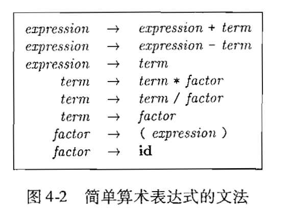
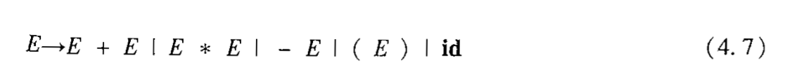
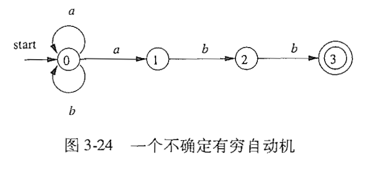
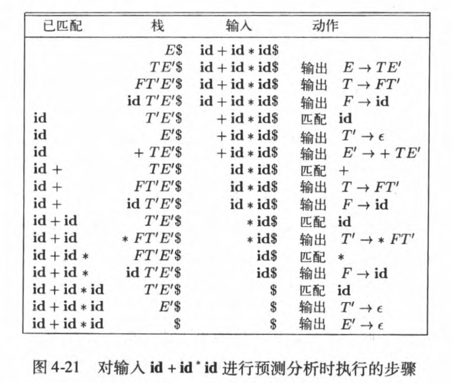

## 语法分析

> α、β、γ, ε

+ 文法给出了一个程序设计语言的精确易懂的语法规约

### 4.1 引论

+ 我们将研究 算术表达式的典型文法
+ 通过表达式文法已经足以说明语法分析的本质， 因为处理表达式的语 法分析技术可以用于处理程序设计语言的大部分构造

#### 4.1.1. 语法分析器的作用


+  语法分析器从词法分析器获得一个由词法单元组成的串， 并验证这 个串可以由源语言的文法生成

+ 从概念上讲， 对于良构的 程序， 语法分析器构造出一棵语法分析树， 并把它传递给编译器的其他部分进一步处理

+ 实际上, 并不需要显式地构造出这棵语法分析树， 因为正如我们将看到的，对源程序的检查和翻译动 作可以和语法分析过程交错完成

+ 处理文法的语法分析器大体上可以分为三种类型

  1. 通用的
     - 像 Cocke-Younger-Kasami算法和Earley算法这样的通用语法分析方法可以对任意文法进行语法分析
     - 然而，这些通用方法效率很低，不能用于编译器产品。

  2. 自顶向下的
     - 自顶向下的方法从语 法分析树的顶部（根结点）开始向底部（叶子结点）构造语法分析树
     - 输入总是按照从左向右的 方式被扫描，每次扫描一个符号

  3. 自底向上的
     - 而自底向上的方法则从叶子 结点开始， 逐渐向根结点方向构造
     - 输入总是按照从左向右的 方式被扫描，每次扫描一个符号。

#### 4.1.2 代表性的文法

##### 4.1.2.1 文法4.1


+ E表示一组以+号分隔的项所组成的表达式
+ T表示由一组以*号分隔的因子所组成的项
+ F表示因子， 它可能是括号括起来的表达式，也肯能是标识符
+ 表示式文法(4.1)属于LR文法类，适用于自底向上的语法分析技术
+ 该文法是左递归的，不能用于自顶向下的语法分析

##### 4.1.2.2 文法4.2


+ 该文法是4.1的无左递归版本，将被用于自顶向下的语法分析

##### 4.1.2.3 文法4.3


- 该文法以相同的方式处理+和*，因此可以用来说明语法分析过程中处理二义性的技术
- 这里的E表示各种类型的表达式。文法(4.3)允许一个表达式,比如a+b*c具有多棵语法分析树

#### 4.1.3 语法错误的处理

+ 语法错误的恢复的一般策略
  1. 恐慌模式的恢复
  2. 短语层次的恢复

+ 程序可能有不同层次的错误
  + 词法错误， 包括标识符、关键字或运算符拼写错误（比如把标识符 ellipsesize 写成 elipseSize）和没有在字符串文本上正确地加上引号
  + 语法错误，包括分号放错地方、花括号，即“ { ”或“} ”，多余或缺失。另一个C语言或 Java 语言中的语法错误的例子是一个 case 语句的外围没有相应的 switch 语句（然而, 语法分析器通常允许这种情况出现，当编译器在之后要生成代码时才会发现这个错误）
  + 语义错误， 包括运算符和运算分量之间的类型不匹配。 例如， 返回类型为 void 的某个 Java方法中出现了一个返回某个值的return语句。
  + 逻辑错误， 可以是因程序员的错误推理而引起的任何错误。 比如在一个 C 程序中应该使 用比较运算符==的地方使用了赋值运算符=。 这样的程序可能是良构的， 但是却没有正 确反映出程序员的意图。

#### 4.1.4 错误恢复策略

+ 恐慌模式的恢复
  + 语法分析器一旦发现错误就不断丢输入中的符号，一次丢弃一个符号， 直到找到同步词法单元 (synchronizing token)集合中的某个元素为止
  + 同步词法单元通常是界限 符，比如分号或者｝
+ 短语层次的恢复
  - 当发现一个错误时，语法分析器可以在余下的输入上进行局部性纠正
  - 常用的局部纠正方法包括 将一个逗号替换为分号、删除一个多余的分号或者插入一个遗漏的分号它主要 的不足在于它难以处理实际错误发生在被检测位置之前的情况。
+ 错误产生式
  - 通过预测可能遇到的常见错误， 我们可以在当前语言的文法中加入特殊的产生式
  - 如果语法分析过程中使用了某个错误产生式， 语法分析器就检测到了一个预期的错误。
+ 全局纠正
  - 在理想情况下， 我们希望编译器在处理一个错误输入串时通过最少的改动将其转化为语法 正确的串
  - 遗憾的是，从时间和空间的角度看，实现这些 方法一般来说开销太大，因此这些技术当前仅具有理论价值

### 4.2 上下文无关文法


+ 使用变量stmt表示语法
+ 使用变量expr表示表达式

#### 4.2.1 上下文无关文法的正式定义

+ 根据2.2节可知，一个上下文无法由终结符号，非终结符号，一个开始符号和一个组产生式组成。
  1. 终结符是组成串的基本符号。
     - 术语"词法单元名字"和终结符号的同义词。
     - 我们假 设终结符号是词法分析器输出的词法单元的第一个分量
  2. 非终结符号是表示串的集合的语法变量
     - 在4.4中，stmt和expr是非终结符号。
     - 非终结符号表示的串集合用于定义由文法生成的语言
     - 非终结符号给出了语言的层次结构，而这种层次结构是语法分析和翻译的关键。
  3. 在一个文法中，某个非终结符号被指定为开始符号。这个符号表示的串集合就是这个文法生成的语言。
  4. 一个文法的产生式，描述了将终结符号和非终结符号组成串的方法。
+ 每个产生式由下列元素组成：
  + ①一个被称为产生式头或左部的非终结符号。 这个产生式定义了这个头所代表的串集合的 一部分。
  + ②符号一>。有时也使用::=来替代箭头。
  + 一个由零个或多个终结符号与非终结符号组成的产生式体或右部。 产生式体中的成分描 述了产生式头上的非终结符号所对应的串的某种构造方法。

+ 例4.5，图4-2中的文法定义了简单的算法表达式。

  

  - 这个文法中终结符号是id + - * / ()
  - 非终结符号是expression， term 和factor
  - expression是开始符号

#### 4.2.2 符号表示的约定

+ 约定下面的符号是终结符号:

  + ①在字母表里排在前面的小写字母，比如a、b、c
  + ②运算符号，比如+、*等。
  + ③标点符号，比如括号、逗号等。
  + ④数字。、1、…、9。
  + ⑤黑体字符串，比如**id**或**if**。每个这样的字符串表示一个终结符号。

+ 约定下面的符号是非终结符号

  - ①在字母表中排在前面的大写字母，比如A、B、C。
  - ②字母S。它出现时通常表示开始符号。
  - ③小写、斜体的名字，比如expr或stmt
  - ④当讨论程序设计语言的构造时，大写字母可以用于表示代表程序构造的非终结符号。
    - 比如，表达式、项和因子的非终结符号通常用E, T和F表示

+ 在字母表中排在后面的大写字母(如X, Y, Z)表示文法符号。也就是说，表示非终结符或终结符

+ 在字母表中排在后面的小写字母(主要是u,v,..z)表示(可能是空的)终结符号串

+ 小写的希腊字母，比如α、β、γ表示（可能为空的）文法符号串。因此，一个普通的产生式可以写作A—>α，其中A是产生式的头, α是产生式的体。

+ 具有相同的头的一组产生式A-> α<sub>1</sub>, A-> α<sub>2</sub>, ..., A-> α<sub>k</sub> (A产生式) 可以写作A—>α<sub>1</sub>|α<sub>2</sub>|....|α<sub>k</sub>，我们可以把α<sub>1</sub>，α<sub>2</sub>，... ， α<sub>k</sub>称为A的不同可选体

+ 除非特别说明，第一个产生式的头就是开始符号

+ 例4.6, 按照这些约定，例4.5可以改为下面更简单的形式

  

  - E,T和F是非终结符号， E为开始符号
  - 其余为终结符号

#### 4.2.3 推导

+ 在文法4.3中增加了一个产生式E-> -E:

  

  - E=> -E=> -(E)=> -(id)

+ 符号=>表示"通过一步推导出"

+ 对于一个推导序列α<sub>1</sub>=>α<sub>2</sub>=> ...=>α<sub>n</sub> ，α<sub>1</sub>推导出α<sub>n</sub>。可用符号=<sup>*</sup>>表示这种关系，即"经过零步或多步推导出"

+ =<sup>+</sup>>表示"经过一步或多步推导出"

+ 串-(id+id)是文法(4.7)的一个句子， 因为存在一个推导过程

  

+ 串-(id+id)的另一种推导

  

+ 两个推导中，每个非终结符号被替换成同一个产生式体，但替换的顺序不同

+ 由上面的两种过程可以，替换非终结符号的两种推导过程

  1. 最左推导: 总是选择每个句型的最左非终结符。如果α=>β 是一个推导步骤，且被替换的是α中的最左非终结符号，我们写作α=<sub>lm</sub>>β
  2. 最右推导: 总是选择每个句型的最右非终结符。此时我们写作α=<sub>rm</sub>>β

+ 推导4.8是最左推导，推导4.9是最右推导

  - 4.8可以写成下面

    

#### 4.2.4 语法分析树和推导

+ 语法分析树是推导的图形表示形式， 其过滤掉了推导过程中对非终结符应用产生式的顺序。

+ 语法分析树的每个内部节点表示一个产生式的应用

+ 图4-3中, -(di+id)的语法分析树可以根据推导4.8得到，也可以根据推导4.9得到

  

+ 语法分析树的叶子节点既可以是非终结符号，也可以是终结符号

+ 例4.10，根据推导4.8得到图4-4， E => -E的推导过程

  

#### 4.2.5 二义性

+ 如果一个文法可以为某个句子生成多棵语法分析树，那么它就是二义性的

+ 换句话说，二义性文法就是对同一个句子有多个最左推导或多个最右推导的文法

+ 例4.11, 文法4.3允许句子id + id * id具有两个最左推导:

  

  
  
  - 图4-5a反应了先*后+的关系
  - 在语法分析的过程中，要消除二义性

#### 4.2.6 验证文法生成的语言

+ 证明文法G生成语言L的过程可以分为两个部分
  1. 证明G生成的每个串都在L中
  2. 证明L中的每个串都确实能由G生成

#### 4.2.7 上下文无关文法和正则表达式

+ 文法是比正则表达式能力更强的表示方法

+ 每个可以使用正则表达式描述的构造，都可以使用文法来描述。但反之不成立

+ 换言之，每个正则表达式都是上下文无关文法，但反之不成立

+ 例如，分别用正则表达式和文法描述以abb结尾的由a和b组成的串的集合

  - 正则表示式(a|b)*abb

  - 文法

    

+ 如何构造上面的文法？

  

  0. 根据图3-24中的NFA构造

  1. 对于NFA的每个i，创建一个非终结符号A<sub>i</sub>
  2. 如果状态i有一个在输出a上到达状态j的转换，则加入产生式A<sub>i</sub>->aA<sub>j</sub>。如果状态i在输入ε上到达状态j， 则假如产生式A<sub>i</sub>->A<sub>j</sub>
  3. 如果i是一个接受状态，则加入产生式A<sub>i</sub>->ε
  4. 如果i是自动机的开始状态，令A<sub>i</sub>为所得文法的开始符号

### 4.3 设计文法

+ 文法能够描述程序设计语言的大部分(但不是全部)语法

#### 4.3.1 词法分析和语法分析

+ 为什么使用正则表达式来定义一个语言的词法语法?
  1. 将一个语言的词法结构分为词法和非词法两部分可以很方便地将编译器前端模块化，将前端分为两个大小适中的组件
  2. 一个语言的词法规则通常很简单，我们不需要使用像文法这样的功能强大的表示方法来描述这些规则
  3. 和文法相比，正则表达式通常提供了更加简洁且易于理解的表示词法单元的方法
  4. 根据正则表达式自动构造的二到的词法分析器的效率要高于根据任意文法自动构造得到的分析器
+ 正则表达式最适合描述如标识符，常量，关键字，空白这样的语言构造的结构。
+ 文法最合适描述嵌套结构。如对称的括号对，匹配的begin-end,相互对应的if-then-else等，这些嵌套结构不能使用正则表达式描述

#### 4.3.2 消除二义性

+ 文法4.14如下， 其具有二义性

  

  - 根据这个文法, 对于串 **if** E<sub>1</sub> **then**  S<sub>1</sub> **else if** E<sub>2</sub> **then** S<sub>2</sub> **else** S<sub>3</sub>的语法分析树，如图4-8

    

  - 对于串 **if** E<sub>1</sub>  **then if** E<sub>2</sub>  **then**  S<sub>1</sub> **else** S<sub>2</sub>， 具有二义性，对应两棵语法树，如图4-9

    

+ 通用的规则是"每个**else**和最近的尚未匹配的**then**匹配"

+ 例4.16，将4.14改为无二义性的文法

  

#### 4.3.3 左递归的消除

+ 如果一个文法中有一个非终结符号A使得A对某个串α存在一个推导 A=<sup>+</sup>>αA，那么这个文法就是左递归的(left recursive)

+ 自顶向下的语法分析方法不能处理左递归的文法，因此需要一个转换方法来消除左递归

+ 将左递归的产生式 A-> Aα | β 替换为非左递归的产生式

  

+ 通过消除表示式文法(4.1)中的立即左递归得到非左递归的表达式文法(4.2)

  

  

  

+ 立即左递归可以使用下面的技术消除, 该技术可以处理任意数量的A产生式

  1. 首先将A的全部产生式分组如下, 其中β<sub>i</sub>都不以A开头

     

  2. 然后将这些A产生式替换为下面的形式

     

+ 通过上面的方法，非终结符A生成的串和替换之前生成的串一样，但不再左递归，但是该方法只能处理立即左递归

+ 对于两步或多步推导而产生的左递归

  

  - 因为S=>Aa=>Sda,所以终结符号S是左递归的，但它不是立即左递归

+ 算法4.19, 消除左递归
  - 算法4.19系统的消除了文法中的左递归。
  - 如果文法中不存环(形如A=<sup>+</sup>>A的推导 )或ε产生式(形如A->ε的产生式)，就能够消除左递归

+ 算法4.19, 消除左递归的过程

  - 输入: 没有环或ε产生式的文法G

  - 输出: 一个等价的无左递归文法

  - 方法: 对G应用图4-11中的算法

    

+ 例4.20, 将算法4.19应用于文法4.18。

  - 将非终结符号排序为S（即A<sub>1</sub>）, A(即A<sub>2</sub>）

  - 在S产生式之间没有立即左递归，因此i=1的外层循环中不进行任何处理

  - 当i=2时，我们替换A->Sd中的S，得到如下的A产生式

    

  - 消除这些A产生式之间的立即左递归，得到如下的文法

    

#### 4.3.4 提取左公因子

+ 提取左公因子是一种个文法转换方法，它可以产生适用于预测分析技术或自顶向下分析技术的文法

+ 算法4.21, 对一个文法提取左公因子

  - 输入: 文法G

  - 输出: 一个等价的提取了左公因子的文法

  - 方法: 对每个非终结符号A, 找出它的两个或多个选项之间的最长公共前缀α。如果α != ε, 即存在一个非平凡的公共前缀，那么将所有A产生式A-> αβ<sub>1</sub>| αβ<sub>2</sub> |...| αβ<sub>n</sub> | γ ,替换为

    

    - γ 表示所有不以α开头的产生式体
    - A<sup>'</sup>是一个新的非终结符号
    - 不断地应用这个转换，直到每个非终结符号的任意两个产生式体都没有公共前缀为止。

+ 对于下面的两个产生式，可以看做A-> αβ<sub>1</sub>| αβ<sub>2</sub>

  

  - 进一步推导为

    

+ 下面的文法抽象表达了"悬空-else"问题

  

  - i，t和e分别代表**if** , **then** , **else**

  - E和S表示"条件表达式"和"语句"

  - 提取左公因子i E t s后，文法变为:

    

  - 当输入i时，将S展开为iEtSS<sup>'</sup>

  - 处理完iEtS之后，才决定将S<sup>'</sup>展开为es还是ε

  - 当输入为e时,不能够确定选择S<sup>'</sup>的哪个产生式??

#### 4.3.5 非上下文无关语言的构造

+ 在常见的程序设计语言中，可以找到少量的不能仅用文法描述的语法构造
+ 标识符的先声明后使用，不是上下文无关的
+ 函数的先声明后使用，前后的参数列表要对应上，也不是上下文无关的

### 4.4 自顶向下的语法分析

+ 自顶向下的语法分析
  - 它从语法分析树的根节点开始，按照先根次序(深度优先)创建这课语法分析树的各个节点
  - 也可以被看做寻找输入串的最左推导的过程

+ 例4.27， 图4-12对应于输入id+id*id的语法分析树序列， 它是一个根据文法4.2进行的最左推导序列

  

  

  - 在图4-12中的自顶向下的语法分析过程中，它构造了一个语法分析树，其中有两个标号为E<sup>'</sup>的节点
  - 第一个E<sup>'</sup>的节点选择的产生式为E<sup>'</sup>->+TE<sup>'</sup>
  - 第二个E<sup>'</sup>的节点选择的产生式为E<sup>'</sup>->ε
  - 之所以选择不同的产生式，是因为预测分析器通过查看下一个输入符号就可以在两个E<sup>'</sup>产生式中选择正确的产生式

+ 对于有些文法，我们可以构造出向前看k个输入符号的预测分析器，这一类文法有时也被称为LL(k)文法类。

#### 4.4.1 递归下降的语法分析

+ 一个递归下降的语法分析程序由一组过程组成，每个非终结符号有一个对应的过程

+ 程序的执行从开始符号对应的过程开始，如果这个过程的过程提扫描了整个输入串，它就停止执行并宣布语法分析成功完成

+ 图4-13显示了对应于某个非终结符号的典型过程的伪代码。

  

  - 这个 伪代码是不确定的，因为它没有描述如何在开始时刻选择A产生式
  - 通用的递归下降分析技术可能需要回溯，但是回溯的语法分析器并不常见，而且回溯也不是很高效
  - 如果要支持回溯，就需要修改图4-13的代码
    1. 首先， 因为我们不能在第1行选定唯一的A产生 式， 我们必须按照某个顺序逐个尝试这些产生式
    2. 那么，第7行上的失败并不意味着最终失败， 而仅仅是建议我们返回到第1行并尝试另一个A产生式
    3. 只有当再也没有A产生式可尝试时， 我 们才会宣称找到了一个输入错误
    4. 为了尝试另一个A产生式， 我们需要把输入指针重新设置到我们第一次到达第1行时的位置
    5. 因此， 需要一个局部变量来保存这个输入指针， 以供将来回溯时使用。

+ 例4.29， 回溯展开下面的文法

  

  + 对于串w= cad进行语法分析

    

    1. 开始时，输入指针指向C,即w的第一个符号。 S只有一个产生式，因此我们用它来展开S,得到图4-14a中的树
    2. 最左边的叶子结点的标号为c, 它和输入w的第一个符号匹配，因此我们将输入 指针推进到a, 即w的第二个符号，并考虑下一 个标号为A的叶子结点 
    3. 先使用第一个A产生式A->ab来展开A,得到图4-14b所示的树
    4. 第二个输入符号a得到匹配，因此我们将输入指针推进到d, 即第三个输入符号，并将d和下一个叶子结点(标号为b)比较。因为b和d不匹配，我们报告失败，并**回溯**到A,査看是否还有尚未尝试过、但有可能匹配的其他A产生式。
    5. 在回到A时，我们必须把输入指针重新设置到位置2,即我们第一次尝试展开A时该指针指向的位置。这意味着A的过程必须将输入指针存放在一个局部变量中
    6. 4 的第二个选项产生了图4-14c所示的树。叶子结点a 和 w的第二个符号匹配，叶子结点d和第三个符号匹配
    7. 此时我们已经产生了一棵w的语法分析树，所以我们停止分析并宣称已成功完成了语法分析。 

#### 4.4.2 FIRST和FOLLOW

+ 在自顶向下语法分析过程中，**FIRST**和 **FOLLOW**使得我们可以根据下一个输入符号来选择应用哪个产生式

+ **FIRST( α)**被定义为可从α 推导得到的串的首符号的集合，其中  α是任意的文法符号串 

  - 如果 α =<sup>*</sup>>  ε, 那么 ε也在**FIRST(α)**中

  - 比如图4-15中, A =<sup>*</sup>>  cγ, 那么c也在**FIRST(A)**中

    

+ 简单介绍一下如何在预测分析中使用**FIRST** 
  1. 考虑两个A产生式 A-> α | β，那么**FIRST(α )**和**FIRST( β)**是不相交的集合
  2. 那么我们只需要查看下一个输入符号a, 就可以在这两个A产生式中进行选择
  3. 因为a只能出现**FIRST(α )**或**FIRST( β)**中，但不能同时出现在两个集合中

+ **FOLLOW(A)**被定义为可能在某些句型中紧跟在A右边的终结符号的集合
  - 如果存在如图4-15所示形如S=<sup>*</sup>>αAaβ的推导，终结符号a就在**FOLLOW(A)**中，其中α和β是文法符号串
  - 在这个推导的某个阶段, A和 a之间可能存在一些文法符号, 但如果
    这样，这些符号会推导得到ε并消失
  - 如果A是某些句型的最右符号，那么$也在**FOLLOW(A)**中, $是一个特殊的“结束标记”符号

+ 计算各个文法符号X的**FIRST(X)**时，不断应用下列规则, 直到没有新的终结符号或ε 可以被加入到任何**FIRST**集合中为止
  1. 如果X是一个终结符号，那么**FIRST(X)** **=** X
  2. 如果X是一个非终结符号， 且X->Y<sub>1</sub>Y<sub>2</sub>...Y<sub>n</sub>是一个产生式，其中k>=1, 如果对于某个i， a在**FIRST(Y<sub>i</sub>)**中，且ε 在所有的**FIRST(Y<sub>1</sub>)**、**FIRST(Y<sub>2</sub>)**、...、**FIRST(Y<sub>i-1</sub>)**中，那么就把a加入到**FIRST(X)** 中。即为Y<sub>1</sub>Y<sub>2</sub>...Y<sub>n</sub> =<sup>*</sup>> ε 。
     - 如果对于所有的j=1、2、... k ，ε在**FIRST(Y<sub>j</sub>)**中，那么 将ε加入到**FIRST(X)**中 
     - 比如，**FIRST(Y<sub>i</sub>)**中的所有符号一定在**FIRST(X)**中。如果Y<sub>1</sub>不能推导出ε,那么我们就不会再向**FIRST(X)**中加入任何符号，但是如果Y<sub>1</sub>=<sup>*</sup>> ε,那么我们就加上 **FIRST(Y<sub>2</sub>),**依此类推 
  3. 如果X->ε是一个产生式，那么将ε加入到**FIRST(X)**中

+ 现在,我们可以按照如下方式计算任何串X<sub>1</sub>X<sub>2</sub>..X<sub>n</sub>的**FIRST**集合
  1. 向**FIRST(X<sub>1</sub>X<sub>2</sub>..X<sub>n</sub>)**加入**F(X)**中所有的非ε符号
  2. 如果ε在**FIRST(X<sub>1</sub>)**中， 再加入**FIRST(X<sub>2</sub>)**中所有非ε符号
  3. 如果ε在**FIRST(X<sub>1</sub>)**, **FIRST(X<sub>2</sub>)**中， 再加入**FIRST(X<sub>3</sub>)**中所有非ε符号, 以此类推
  4. 最后，如果对所有的i，ε都在**FIRST(X<sub>i</sub>)**中，那么将ε加入到**FIRST(X<sub>1</sub>X<sub>2</sub>..X<sub>n</sub>)**中

+ 计算所有非终结符号A的 **FOLLOW(A)**集合时，不断应用下面的规则， 直到再没有新的终结符号可以被加入到任意**FOLLOW**集合中为止
  1. 将$放到**FOLLOW(S)**中，其中**S**是开始符号，而$是输入右端的结束标记
  2. 如果存在一个产生式**A->aBβ,**那么**FIRST (β)**中除ε之外的所有符号都在**FOLLOW(B)**中
  3. 如果存在一个产生式**A->aB**, 或存在产生式**A->aBβ**且**FIRST(β)**包含**ε**，那么**FOLLOW(A)**中的所有符号都在**FOLLOW(B)**中
     - 针对产生式**A->aB**
       1. **FOLLOW(A)**即为紧跟A的右边的终结符集合
       2. **FOLLOW(B)**即为紧跟B的右边的终结符集合
       3. 从产生式可知，紧跟A的右边的终结符集合, 即为紧跟B的右边的终结符集合
     - 产生式**A->aBβ**且**FIRST(β)**包含**ε**，
       1. **FOLLOW(A)**即为紧跟A的右边的终结符集合
       2. **FOLLOW(B)**即为紧跟B的右边的终结符集合
       3. 从产生式和条件可知, **FIRST(β)**可推导出ε, 因此**FOLLOW(A)**中的所有符号都在**FOLLOW(B)**中

#### 4.4.3 LL(1)文法

+ 对于称为**LL(1)**的文法，我们可以构造出预测分析器，即不需要回溯的递归下降语法分析
  器。
  1. 第一个**L**表示从左向右扫描输入
  2. 第二个**L**表示产生最左推导
  3. 而**1**则 表示在每一步中只需要向前看一个输入符号来决定语法分析动作。 

+ 预测分析器的转换图

  

  

  - 转换图有助于将预测分析器可视化
  - 图4-16a中显示了文法4.28中非终结符号E和E<sup>'</sup>的转换图 
  - 要构造一个文法的转换图，首先要消除左递归，然后对文法提取左公因子
  - 然后对每个非终结符号A:
    1. 创建一个初始状态和一个结束(返回)状态
    2. 对于每个产生式**A->X<sub>1</sub>X<sub>2</sub>..X<sub>n</sub>**创建一个从初始状态到结束状态的路径，路径中各条边的标号为**X<sub>1</sub>X<sub>2</sub>..X<sub>n</sub>**。如果那么这条路径就是一条标号为ε的边 

+ 一个文法G是LL(1)的，当且仅当G的任意两个不同的产生式A->a|β满足下面的条件:
  1. 不存在终结符号a使得α和β都能够推导出a开头的串
  2. α和β中最多只有一个可以推导出空串
  3. 如果 β=<sup>*</sup>> ε ，那么α不能推导出任何以FOLLOW(A)中某个终结符号开头的串。
     - 同样的，如果 α=<sup>*</sup>> ε ，同样的， 那么β不能推导出任何以FOLLOW(B)中某个终结符号开头的串

+ 之所以能够为**LL(1)**文法构造预测分析器，原因是只需要检查当前输入符号就可以为一个
  非终结符号选择正确的产生式

  - 下面的文法，通过向前看一个字符, 即可确定产生式

  

  

+ 算法4.31，构造一个预测分析表
  - 输入: 文法G
  - 输出: 预测分析表M
  - 方法: 对于文法G的每个产生式**A->α**， 进行如下处理
    1. 对于**FIRST(α)**的每个终结符号a,  将**A->α**加入到**M[A, a]**中。
    2. 如果**ε**在**FIRST(α)**中，那么对于**FOLLOW(A)**中的每个终结符号b,将**A->α**加入到**M[A, b]**中。如果**ε**在**FIRST(α)**中，且$在**FOLLOW(A)**中， 也将**A->α**加入到**M[A, $]**中。

+ 例4.32, 对于文法4.28, 算法4.31生成了图4-17中的预测分析表

  

  

  - 空白条目表示错误条目
  - 非空白的条目中指明了应该用其中的产生式来扩展相应的非终结符号

#### 4.4.4 非递归的预测分析

+ 我们可以构造出一个非递归的预测分析器，它显式地维护一个栈结构，而不是通过递归调用的方式隐式地维护栈 

+ 如果w 是至今为止已经匹 配完成的输入部分，那么栈中保存的文法符号序列α 满足 

  

+ 图4-19是一个分析表驱动的预测分析器的模型

  

  1. 有一个输入缓冲区
  2. 一个包含了文法符号序列的栈
  3. 一个由算法4.31构造得到的分析表
  4. 一个输出流
  5. 它的输入缓冲区中包含要进行语法分析的串，串后面跟有结束标记$
  6. 我们复用符号$来标记栈底
  7. 在开始时刻，栈中$的上方是开始符号S

+ 语法分析器由一个程序控制。 该程序考虑栈顶符号X和当前输入符号a。 

  1. 如果X是一个非终结符号，该分析器査询分析表M中的条目**M[X, a]**来选择一个X产生式
  2. 否则，它检查终结符号X和当前输入符号a是否匹配

+ 这个语法分析器的行为可以使用它的格局(configuration)来描述。格局描述了栈中的内容和 

  余下的输入 。

+ 算法4.34，表驱动的预测语法分析，该算法描述了如何处理格局

  + 输入:一个串w， 文法G的预测分析表M

  + 输出:如果w在**L(G)**中，输出w的一个最左推导；否则给出一个错误指示

  + 方法:  最初，语法分析器的格局如下：输入缓冲区中是**w$**, 而G的开始符号S位于栈顶，它 

    的下面是$ 。 图4-20中的程序使用预测分析表M 生成了处理这个输入的预测分析过 

    

+ 例4.35， 考虑文法4.28, 图4.17是对应的预测分析表, 处理输入id + id * id时， 算法4.34的非递归预测分析顺序执行图4-21中显示的各个步骤, 这些步骤对应于一个最左推导(完整的推导过程见图4-12)

  

  

  

  

#### 4.4.5 预测分析中的错误恢复

+ 恐慌模式
+ 短语层次的恢复

### 4.5 自底向上的语法分析

+ 一个自底向上的语法分析过程对应于为一个输入串构造语法分析树的过程，它从叶子结点 

  (底部)开始逐渐向上到达根结点(顶部) 

+ 将语法分析描述为语法分析树的构造过程会比较方便，虽然编译器前端实际上不会显式地构造出语法分析树，而是直接进行翻译 

+ 图425中显示 的分析树的快照序列演示了按照表达式文法(4.1)对词法单元序列**id** ***** **id**进行的自底向上语法 分析的过程。 

  

  

+ 虽然手工构造一个LR语法分析器的工作量非常大, 但借助语法分析器自动生成工具可以使人们轻松地根据适当的文法构造出高效的**LR**分析器

#### 4.5.1 归约

+ 我们可以将自底向上语法分析过程看成将一个串**归约**为文法开始符号的过程

+ 在**每个归约(reduction)步骤**中，一个与某产生式体相匹配的特定子串被**替换为该产生式头部的非终结符号**。 

+ 例4.37 ， 使用如下的符号串序列来讨论4-25的归约过程

  

  - 第一次归约使用产生式**F->id,**将最左边的**id**归约为**F,**得到串**F** ***** **id**
  - 第二次归约将**F**归约为**T,**生成**T** * **id**。
  - 将第二个id归约为F,得到串**T * F**
  - 然后这个串被归约为**T**
  - 最后将T归约为开始符号**E,**从而结束整个语法分析过程

+ 一次归约是一个推导步骤的反向操作, 因此，自底向上语法分析的目标是反向构造一个推导过程

  - 下面的推导对应于图4-25中的分析过程, 这个推导过程实际上是一个最右推导

    

#### 4.5.2 句柄剪枝

+ 对输入进行从左到右的扫描，并在扫描过程中进行自底向上语法分析，就可以反向构造出一
  个最右推导

+ "句柄"是和某个产生式体匹配的子串，对它的归约代表了相应的最右推导中的一个反向步骤。

+ 在按照表达式文法(4.1)对id<sub>1</sub>*id<sub>2</sub>进行语法分析时，各个句柄如图4-26所示

  

+ 如果有S=<sup>*</sup><sub>rm</sub>>αAw=<sub>rm</sub>>αβw， 那么紧跟α的产生式A->β 是αβw的一个句柄(handle )

  

#### 4.5.3 移入-归约语法分析技术

+ 移入-归约语法分析是自底向上语法分析的一种形式
  - 它使用一个栈来保存文法符号
  - 并用一个输入缓冲区来存放将要进行语法分析的其余符号
  - 我们将看到，句柄在被识别之前，总是出现在栈的顶部。 

+ 移入-归约语法分析的基本过程

  1. 开始的时候栈是空的，并且输入串w存放在输入缓冲区中

     

  2. 在对输入串的一次从左到右扫描过程中，语法分析器将零个或多个输入符号移到栈的顶端, 

     直到它可以对栈顶的一个文法符号串β 进行归约为止。

  3. 它将β 归约为某个产生式的头。语法分析器不断地重复这个循环，直到它检测到一个语法错误，或者栈中包含了开始符号且输入缓冲区为空为止，完成了语法分析过程

     

+ 图4-28显示了一个移入-归约语法分析器在按照表达式文法(4. 1)对输入串__id<sub>1</sub> * id<sub>2</sub>__进行语法分析时可能采取的动作。

  

  + 虽然主要的语法分析操作是移入和归约，但实际上一个移入-归约语法分析器可采取如下种可能的动作:1移入，2归约，3接受，4报错
    1. 移入(shift):将下一个输入符号移到栈的顶端。
    2. 归约(reduce):被归约的符号串的右端必然是栈顶。语法分析器在栈中确定这个串的左端，并决定用哪个非终结符号来替换这个串。
    3. 接受(accept):宣布语法分析过程成功完成
    4. 报错(error):发现一个语法错误，并调用一个错误恢复子例程。 

+ 我们之所以能够在移入-归约语法分析中使用栈，是因为这个分析过程具有如下重要性质:句柄总是出现在栈的顶端，绝不会出现在栈的中间

#### 4.5.4 移入-归约语法分析中的冲突

+ 有些上下文无关文法不能使用移入-归约语法分析技术
+ 从技术上来讲，这些文法不在4.7 节定义的**LR(k)**文法类中，我们把它们称为非**LR**文法
+ **LR(k)**中的k表示在输入中向前看k个符号
+ 在编译中使用的文法通常属于LR(1)文法类，即最多只需要向前看一个符号。
+ 一个二义性文法不可能是LR的

### 4.6 LR语法分析技术介绍:简单**LR**技术

+ 目前最流行的自底向上语法分析器都基于所谓的**LR(k)**语法分析的概念
  1. **L**表示对输入进行从左到右的扫描
  2. **R** 表示反向构造出一个最右推导序列
  3. k表示在做出语法分析决定时向前看k个输入符号
  4. k=0 和k= 1这两种情况具有实践意义，因此这里我们将只考虑k<=1的情况。当省略(k)时，我们假设k = 1.

+ **"简单LR技术"(或简称为SLR)**: 最简单的构造移入-归约语法分析器的方法

#### 4.6.1 为什么使用**LR**语法分析器

+ LR语法分析器是表格驱动的

+ 只要存在这样一个从左到右扫描的移入-归约语法 分析器，它总是能够在某文法的最右句型的句柄出现在栈顶时识别出这个句柄，那么这个文法就 是 **LR**的。 

+ LR语法分析技术很有吸引力，原因如下:

  - 对于几乎所有的程序设计语言构造，只要能够写出该构造的上下文无关文法，就能够构
    造出识别该构造的LR语法分析器

    ```
    确实存在非LR的上下文无关文法，但一般来说，常见的程序设计语言构造都可以避免使用这样的文法。
    ```

  - LR语法分析方法是已知的最通用的无回溯移入-归约分析技术，并且它的实现可以和其他更原始的移入-归约方法(见参考文献)一样高效

  - 一个LR语法分析器可以在对输入进行从左到右扫描时尽可能早地检测到错误

  - 可以使用LR方法进行语法分析的文法类是可以使用预测方法或LL方法进行语法分析的
    文法类的真超集

+ LR方法的主要缺点是为一个典型的程序设计语言文法手工构造LR分析器的工作量非常大

  - 我们需要一个特殊的工具，即一个LR语法分析器生成工具
  - 将在4. 9 节讨论其中最常用的工具Yacc。 
  - 这种生成工具将一个上下文无关文法作为输入，自动生成一个该文法的语法分析器

#### 4.6.2 项和**LR(0)**自动机

+ 一个移入-归约语法分析器怎么知道何时进行移入、何时进行归约呢？

  - 当图4-28中栈的内容为$ T而下一个输入符号是*时，语法分析器是怎么知道位于栈顶的T不是句柄，因此正确的动作是移入而不是将T归约到E呢? 

    

+ 一个LR语法分析器通过维护一些状态，用这些状态来表明我们在语法分析过程中所处的位置，从而做岀移入-归约决定。

  - 这些状态代表了 "项"(item)的集合

  - 一个文法G的一个**LR(0)项**(简称为项)是G的一个产生式再加上一个位于它的体中某处的点

    - 例如, 产生式**A->XYZ**产生了四个项

      

    - 产生式A->ε只生成了一个项 

      

+ 项集的表示
  + 一个生成自底向上语法分析器的生成工具可能需要便利地表示项和项集
  + 一个 项可以表示为一对整数 
    1. 第一个整数是基础文法的产生式编号
    2. 第二个整数是点的位置
  + 项集可以用这些数对的列表来表示
  + 需要用到的项集通常包含“闭包”项， 这些项的点位于产生式体的开始处
  + 这些项总是可以根据项集中的其他项重新构造出来，因此我们不必将它们包含在这个列表中。

+ 项的示例解释
  - 项**A->•XYZ**表明我们希望接下来在输人中看到一个从XYZ推导得到的串
  - 项**A->X•YZ**说明我们刚刚在输入中看到了一个可以由X推导得到的串，并且我们希望接下来看到一个能从YZ推导得到的串 
  - 项**A->XYZ•**表示我们已经看到了产生式体XYZ，已经是时候把 XYZ归约为A了

+ 一个称为规范**LR(0)**项集族(canonical LR(0) collection)的一组项集提供了构建一个确定有穷自动机的基础 
  - 该自动机可用于做出语法分析决定
  - 这样的有穷自动机称为**LR(0)自动机**
  - 这个LR(0)自动机的每个状态代表了规范LR(0)项集族中的一个项集
+ 为了构造一个文法的规范LR(0)项集族，我们定义了一个增广文法(augmented grammar)和两个函数:**CLOSURE**和**GOTO**
  - 如果**G**是一个以**S**为开始符号的文法，那么**G**的增广文法**G<sup>'</sup>**就 是在G中加上新开始符号**S<sup>'</sup>，**和产生式**S<sup>'</sup>-> S**而得到的文法。 
  - 引入这个新的开始产生式的目的是告诉语法分析器何时应该停止语法分析并宣称接受输入符号串
  - 当且仅当语法分析器要使用规则 **S<sup>'</sup>-> S**进行归约时,输入符号串被接受。 

+ 表达式文法(4.1)的对应的自动机显示在图4-31中

  

  

